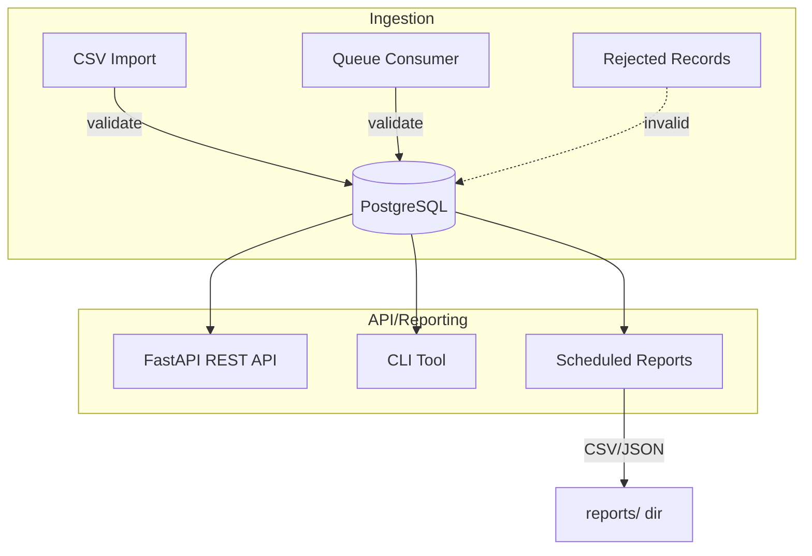

# ACME Transactions System

A robust, containerized payment transaction system built with Python, FastAPI, PostgreSQL, and RabbitMQ. It demonstrates real-time and batch ingestion, reporting, and automation—all production-ready and easy to run with Docker Compose.

---

## Features
- **Relational database schema** for users, transactions, currencies, and rejected records
- **Ingest transactions from RabbitMQ** (JSON messages)
- **Import transactions from CSV** (with validation, duplicate/suspicious detection)
- **Reporting** via REST API, CLI, and scheduled jobs (CSV/JSON export)
- **Rejected record tracking** (invalid data from any source)
- **Fully containerized** with Docker Compose (with healthchecks)
- **Comprehensive documentation and code comments**

---

## Architecture



---

## 🚀 Quick Setup (One Command!)

For the fastest setup experience, run our automated setup script:

```sh
python3 setup_and_test.py
```

This script will:
- ✅ Check all prerequisites (Docker, Docker Compose, files)
- ✅ Build and start all containers
- ✅ Apply database migrations
- ✅ Seed initial data
- ✅ Run all automated tests
- ✅ Perform manual testing of all features
- ✅ Generate a comprehensive test report

**Requirements:** Docker, Docker Compose, Python 3.11+, and a `.env` file (copy from `.env.example`)

---

## 📖 Extensive Manual: Setup, Migrations, Usage & Testing

### 1. Prerequisites
- Docker and Docker Compose installed
- (Optional) Python 3.11+ for local scripts

### 2. Clone the Repository
```sh
git clone git@github.com:milovan-minic/acme_transaction_system.git
cd acme_project/transactions
```

### 3. Environment Setup
- Copy `.env.example` to `.env` and review/edit as needed:
  ```sh
  cp .env.example .env
  ```
- Key variables:
  - `DATABASE_URL` (PostgreSQL connection string)
  - `RABBITMQ_URL` (RabbitMQ connection string)

### 4. Build and Start the Stack
```sh
make up
```
- This will build and start PostgreSQL, RabbitMQ, and the FastAPI app with healthchecks.

### 5. Database Migrations (Alembic)
#### a. Apply all migrations (upgrade to latest):
```sh
make migrate
# or
docker compose run --rm app alembic upgrade head
```
#### b. Create a new migration (after changing models):
```sh
docker compose run --rm app alembic revision --autogenerate -m "Your migration message"
```
#### c. Revert (downgrade) the last migration:
```sh
docker compose run --rm app alembic downgrade -1
```
#### d. View migration history:
```sh
docker compose run --rm app alembic history
```
#### e. Troubleshooting:
- If you get errors about missing revisions or broken chains, check `app/alembic/versions/` and ensure all `down_revision` values are correct and all files are present.
- To reset the DB and start fresh:
  ```sh
  docker compose down -v
  make up
  make migrate
  make seed
  ```

### 6. Seed Initial Data
```sh
make seed
# or
docker compose exec app python seed.py
```

### 7. API Usage
- Open [http://localhost:8000/docs](http://localhost:8000/docs) for interactive Swagger UI.
- Example endpoints:
  - `GET /users`, `POST /users`, `PATCH /users/{user_id}`, `DELETE /users/{user_id}`
  - `GET /currencies`, `POST /currencies`, `PATCH /currencies/{code}`, `DELETE /currencies/{code}`
  - `GET /reports/payments/{user_id}` (with/without `start_date`, `end_date`, `format=csv`)
  - `GET /reports/daily_totals/{user_id}`

### 8. CLI Usage
- List users:
  ```sh
  docker compose exec app python manage_cli.py list-users
  ```
- Add user:
  ```sh
  docker compose exec app python manage_cli.py add-user --id user4 --name "Diana"
  ```
- Edit user:
  ```sh
  docker compose exec app python manage_cli.py edit-user --id user4 --name "Diana Updated"
  ```
- Delete user:
  ```sh
  docker compose exec app python manage_cli.py delete-user --id user4
  ```
- Similar commands for currencies.
- Reporting CLI:
  ```sh
  docker compose exec app python report_cli.py payments user1 --format csv --output user1_payments.csv
  docker compose exec app python report_cli.py daily_totals user1 --format json --output user1_daily.json
  ```

### 9. CSV Import
- Place your CSV in `app/data/in/` (see `sample_transactions.csv` for format).
- Import:
  ```sh
  docker compose exec app python csv_importer.py data/in/sample_transactions.csv
  ```
- Invalid rows are saved to the `rejected_records` table.

### 10. Queue Ingestion
- Start the consumer:
  ```sh
  docker compose exec app python queue_consumer.py
  ```
- Send test messages:
  ```sh
  docker compose exec app python queue_producer.py
  ```
- Invalid messages are saved to the `rejected_records` table.

### 11. Scheduled Reports
- Run scheduled job (default: daily at midnight, current month):
  ```sh
  docker compose exec app python scheduled_reports.py
  ```
- Run once for a specific month:
  ```sh
  docker compose exec app python scheduled_reports.py --run-once --month 2025-07 --output-dir reports/
  ```
- Reports are saved in the `reports/` directory by default.

### 12. Testing
- Run all automated tests:
  ```sh
  make test
  # or
  docker compose run --rm app pytest
  ```
- All tests in `app/tests/` should pass.

### 13. Troubleshooting & FAQ
- **Migrations fail or DB errors?**
  - Check migration order and `down_revision` values in `app/alembic/versions/`.
  - Try resetting the DB: `docker compose down -v && make up && make migrate && make seed`
- **API endpoints not found?**
  - Restart the app container: `docker compose restart app`
- **RabbitMQ not reachable?**
  - Check `docker compose logs rabbitmq` and ensure ports are not in use.
- **How do I reset the database?**
  - `docker compose down -v` then re-run migrations and seed.
- **How do I add more users/currencies?**
  - Edit `seed.py` or use the CLI/API.
- **How do I extend the system?**
  - Add new ingestion scripts, reporting logic, or API endpoints as needed. The codebase is modular and well-documented.

---

## Directory Structure

- `app/` - Python application source code
  - `main.py` - FastAPI app entrypoint
  - `api.py` - REST API endpoints
  - `models.py` - SQLAlchemy models
  - `db.py` - DB connection
  - `seed.py` - Seed users/currencies
  - `queue_consumer.py` - RabbitMQ consumer
  - `queue_producer.py` - RabbitMQ producer (for testing)
  - `csv_importer.py` - CSV import tool
  - `reporting.py` - Reporting logic
  - `report_cli.py` - CLI reporting tool
  - `scheduled_reports.py` - Scheduled reporting job
- `alembic/` - Database migrations
- `docker-compose.yml` - Container orchestration
- `README.md` - This file

---

## Testing

- Use the CLI, API, and sample data as shown above.
- Check the `rejected_records` table for invalid data.
- All automated tests are in `app/tests/` and can be run with `make test`.

---

## License
MIT
